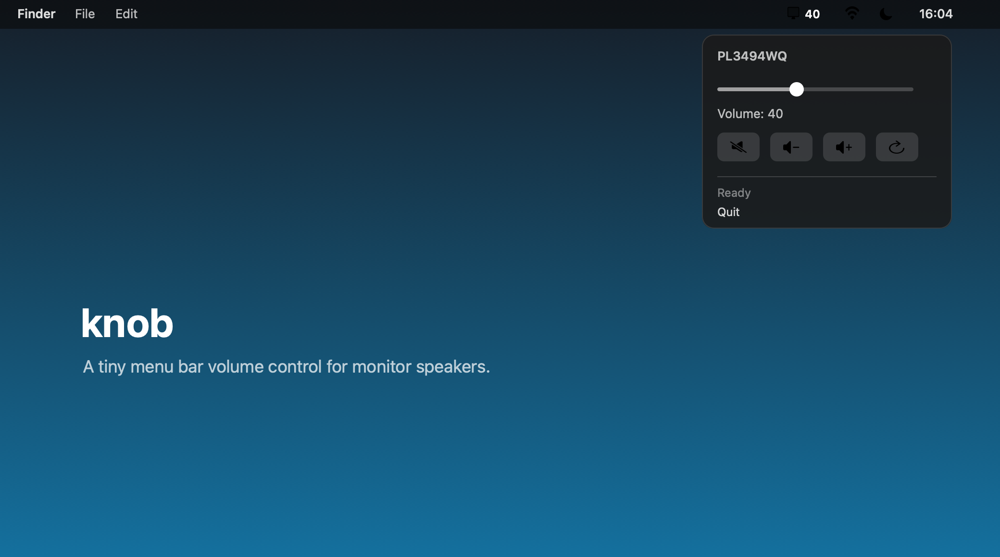
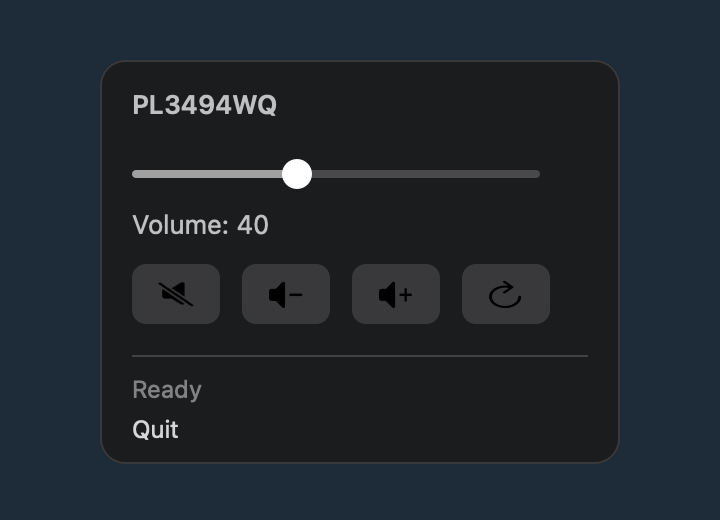

# knob



`knob` is a tiny macOS menu bar app for changing the speaker volume on an external monitor when macOS refuses to show a volume slider for it.

It was made because an iiyama `PL3494WQ` monitor exposed audio over DisplayPort, but macOS would not let the monitor volume be adjusted from Sound settings. The monitor did support DDC/CI volume control, so `knob` puts that control back where it belongs: in the menu bar.

Built in about ten minutes with GPT-5.5 medium.

## What it does



- Shows a small display icon plus the current monitor volume in the macOS menu bar.
- Opens a compact menu with a slider.
- Adds four quick controls: mute, volume down, volume up, refresh.
- Reads the monitor volume when the menu opens, so the UI stays in sync with the display.
- Runs as a menu bar app without a Dock icon.

## Requirement

`knob` uses [`m1ddc`](https://github.com/waydabber/m1ddc) to talk to the monitor over DDC/CI.

```sh
brew install m1ddc
```

Your monitor and cable path need to support DDC/CI. USB-C / DisplayPort Alt Mode is the happy path on Apple Silicon Macs.

## Build

```sh
./build.sh
```

This creates:

```text
knob.app
```

## Run

```sh
open knob.app
```

## Install

Download the latest release from:

```text
https://github.com/otaliptus/knob/releases
```

Or install with Homebrew:

```sh
brew install --cask otaliptus/tap/knob
```

To start it automatically after login, add `knob.app` in:

```text
System Settings -> General -> Login Items
```

## Notes

This is intentionally small. It is not trying to replace BetterDisplay, Lunar, or MonitorControl. It is just a neat little volume knob for one external monitor.

The first release is signed with an Apple Distribution certificate, but not notarized yet. A future release should use a Developer ID Application certificate plus Apple notarization.
